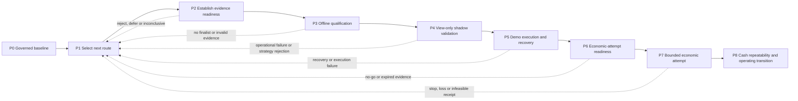

# Mynyra execution roadmap baseline

**Version:** 0.2 
**Prepared:** 2026-09-12 UTC 
**Revised:** 2026-09-17 UTC 
**Status:** owner-approved working baseline; repository reconciliation pending review 
**Reference revision:** `8d5081131af3b88cb45f554a2d730d7108ca8ddb`
**Approval:** owner approved the working baseline and authorized
`WP-P1-ROUTE-001` in the 2026-09-12 project thread. 

## 1. Purpose and authority

This document turns Mynyra's project definition into a concrete execution
roadmap. It separates three things that must not be confused:

1. **Program phases** describe movement toward the economic outcome.
2. **The work-package cycle** controls how bounded work is defined, prepared,
   executed, verified, decided and handed off inside any program phase.
3. **Capability tracks** supply data, software, research, account, operational
   and coordination capabilities when a selected phase needs them.

The [canonical project specification](PROJECT_CANONICAL.md) remains the governing
project definition and management design. The
[canonical problem specification](03-Mynyra_Real_Problem_Specification_CANONICAL.md)
remains the economic authority. Campaign protocols, registries and freezes own
their exact scientific rules and decisions. Current owner instructions govern
authorization.

This baseline does not start a phase, approve spending, unseal data, authorize a
new research campaign, implement an MCP service, broaden cTrader access or permit
an order. Phase entry requires the gate defined here plus the applicable explicit
authority.

## 2. Execution model

The roadmap is evidence-gated, not calendar-gated. A phase may end in rejection,
inconclusive evidence, invalid evidence, deferral or abandonment. Such an outcome
can be complete and useful even when the project does not advance.

Earlier preparation may overlap when it is read-only and authorized, but it does
not satisfy a later gate. For example, account-rule research may begin before a
strategy survives, while paid account acquisition remains prohibited until the
economic-readiness gate passes.

## 3. Program phases

### P0 — Establish the governed baseline

**Purpose:** make the current state, objective, authorities, evidence, restrictions
and ownership reconstructable before consequential work.

**Required inputs:** current repository revision, project instructions, canonical
specifications, applicable campaign decisions, private-evidence availability and
current owner instructions.

**Required outputs:**

- source-bound current-state record;
- established facts separated from reported evidence, inferences and unknowns;
- named executor, reviewer where required, decision owner and record custodian;
- current restrictions, sensitive-data boundary and prohibited actions;
- unresolved thresholds and the decisions they block;
- one explicit current disposition and one permitted next decision.

**Exit gate G0:** another operator can recover the same current decision and
boundaries from the cited sources at the cited revisions. Conflicts and unavailable
evidence are explicit. Completion of G0 does not resolve economic unknowns that are
not yet needed.

**Current status:** established at project level through PR #13, subject to refresh
at every material re-entry. Volatile external facts and private evidence still
require environment-specific checks.

### P1 — Select the next economic or information route

**Purpose:** choose the smallest worthwhile next route after comparing its expected
economic movement, decision value, resource demand, irreversible downside and
failure residue.

**Required inputs:** G0 baseline, previous dispositions, available time/capital,
applicable risk limits, unresolved decisions and feasible alternatives.

**Required outputs:**

- the decision the next work package must enable;
- at least one materially different alternative, including pause or stop when
  credible;
- expected information and how it would change a later decision;
- included and excluded scope;
- time, spend, access and exposure bounds;
- STOP and revisit conditions;
- exact authority, executor, reviewer and decision owner;
- selected route or an explicit defer/abandon decision.

**Exit gate G1:** exactly one bounded work package is selected and authorized for
readiness work, or no work is selected and the reason and revisit trigger are
recorded. Selecting a route does not authorize all downstream phases.

**Current status:** active re-entry gate. The five-candidate comparison and Praxis
Step 4 both closed with no advancing finalist. No fifth research batch, shadow
campaign, order path or economic attempt follows automatically.

### P2 — Establish evidence and execution readiness

**Purpose:** turn the selected route into an executable, falsifiable and recoverable
contract before decision-producing outcomes are inspected.

**Required workstreams, as applicable:**

- strategy hypothesis and exact causal rules;
- source, dataset, quote-side, time, split and revision identity;
- account/provider eligibility, current rules and feasible receipt path;
- technical interfaces, failure semantics and resource bounds;
- risk, recovery, privacy and evidence-retention requirements;
- evaluation, review and decision procedure.

**Required outputs:** fixed work-package record, protocol or implementation
contract, identified inputs, attempt identity, acceptance and rejection criteria,
verification plan, recovery procedure, protected-data rules and dry-run evidence.

**Exit gate G2:** inputs and dependencies are available or explicitly bounded;
rules cannot change after result inspection without a new version; normal and
failure-path tests are defined; execution authority covers the exact work; and a
failed or interrupted attempt leaves useful recoverable state.

**Failure route:** return to P1 when the route is infeasible, too costly, lacks
decision value, has unavailable prerequisites or cannot be executed safely.

**Current status:** reusable historical-data, simulation, catalog and read-only
cTrader capabilities exist. They support conservative historical screening, not
all-session cost, fill, independent-evaluation, shadow, demo or cash claims. No new
route-specific readiness package is active under this baseline.

### P3 — Perform offline qualification

**Purpose:** reject weak candidates cheaply and determine whether any fixed
candidate warrants forward view-only validation.

**Required inputs:** G2 contract, normalized UTC inputs, fixed chronological
partitions, registered costs and sizing, unchanged baselines, selection criteria,
evaluation-seal rules and create-only evidence paths.

**Required outputs:** every registered case and attempt, complete result inventory,
replay and accounting evidence, sensitivity results, candidate dispositions,
limitations, finalist freeze and an explicit evaluation decision.

**Exit gate G3:** a candidate may advance only if it passes its preregistered gates,
its result and lineage are reproducible, applicable independent-evaluation
conditions are satisfied, and the decision owner explicitly advances it. No
survivor is a valid completed outcome.

**Failure route:** rejection, invalid evidence or unavailable independent evidence
returns the project to P1. It does not justify inspecting sealed data or changing
rules in place.

**Current status:** closed with rejection for both completed campaigns. April
remains sealed; there is no active finalist.

### P4 — Validate unchanged behavior in view-only shadow mode

**Purpose:** test whether an unchanged historical survivor produces usable signals
against forward FIBO bid/ask data without sending orders.

**Required inputs:** G3 finalist freeze, unchanged strategy identity, current
view-only account access, explicit observation window, market-session coverage,
cost/slippage treatment, data-gap handling and restart procedure.

**Required outputs:** timestamped signals, contemporaneous quotes, simulated fills,
spread/session coverage, missed-data record, restart/recovery evidence, deviations
from historical assumptions and an unchanged-strategy disposition.

**Exit gate G4:** the candidate remains acceptable under its fixed forward criteria;
the capture is complete enough for the stated claim; failures and gaps are bounded;
and the decision owner approves consideration of demo execution.

**Failure route:** reject or return to P1. Strategy changes require a new historical
contract rather than an in-place shadow repair.

**Current status:** not entered and currently blocked by the absence of a finalist.

### P5 — Prove bounded demo execution and recovery

**Purpose:** verify order lifecycle, risk enforcement, reconciliation and recovery
using demo-only execution before any economic exposure.

**Required inputs:** G4 survivor, explicit owner authorization for demo orders,
implemented request allowlist change, per-trade and aggregate demo limits, expected
price/size rounding, acknowledgement/fill/rejection semantics, uncertain-submission
handling, restart reconciliation and emergency STOP behavior.

**Required outputs:** normal and adverse execution traces, rejected/partial/unknown
outcome handling, duplicate-prevention evidence, position/account reconciliation,
restart and recovery proof, limit-enforcement tests and a demo disposition.

**Exit gate G5:** bounded demo behavior and recovery pass their exact contract.
Passing proves operational behavior in the tested demo environment only; it does
not establish profitability, provider eligibility or authorization to spend.

**Failure route:** stop execution, preserve evidence and return to P1 or P2. Never
resubmit an uncertain order before reconciliation.

**Current status:** not entered. No order-placement path is implemented or
authorized.

### P6 — Decide economic-attempt readiness

**Purpose:** decide whether a paid, prop or live economic attempt is justified and
survivable using current strategy, operational, account and personal-risk evidence.

**Required inputs:** G5 proof; current provider eligibility and automation rules;
drawdown, leverage, fee, profit-split and payout terms; practical cash-receipt route;
personal loss, spend, debt, attempt and STOP limits; operating costs and recovery
reserve; stale-evidence review.

**Required outputs:** reconciled expected economics, downside and failure residue;
provider/account decision; exact budget and exposure envelope; attempt count;
responsible operator; monitoring and reconciliation plan; go/no-go decision and
authority reference.

**Exit gate G6:** the owner explicitly authorizes one bounded attempt with exact
scope and limits, or records no-go/defer. A technically successful demo cannot
substitute for this decision.

**Current status:** not entered. The necessary personal and account-specific
economic thresholds are unresolved.

### P7 — Run one bounded authorized economic attempt

**Purpose:** execute only the G6-authorized attempt, preserve capital and evidence,
and determine whether profit can become cash under the verified rules.

**Required inputs:** active G6 authorization, unchanged approved strategy/system,
funding and account controls, monitoring, reconciliation, withdrawal procedure,
incident response and STOP conditions.

**Required outputs:** complete transaction and decision ledger, costs, failures,
rule compliance, account state, withdrawability, withdrawal attempt, cash-receipt
evidence and remaining net usable assets.

**Exit gate G7:** classify the attempt as loss/stop, invalid, no payout, cash
received or another exact disposition. Keep gross P&L, realized account profit,
withdrawable profit, received cash and net usable assets separate.

**Failure route:** apply STOP conditions, prevent unauthorized retries, preserve the
remaining state and return the next decision to P1. One attempt does not authorize
another.

**Current status:** not entered and not authorized.

### P8 — Establish repeatability and transition to operation

**Purpose:** determine whether repeated net cash receipts materially finance
continued operation and survive the ordinary failures defined by the owner.

**Required inputs:** qualifying G7 result, accepted cash target and measurement
period, operating-cost baseline, repeatability duration, reserve requirement,
permitted reinvestment and ongoing risk/STOP policy.

**Required outputs:** reconciled sequence of qualifying receipts and losses,
operating coverage, remaining reserve, external-financing dependence, maintenance
and recovery performance, and owner acceptance or rejection of self-sufficiency.

**Exit gate G8:** the owner accepts evidence against the canonical economic
completion criteria. If accepted, recurring profitable operation becomes an
operating responsibility with monitoring and periodic revalidation; it is not an
indefinitely unfinished development phase.

**Current status:** not entered. No cash-receipt or repeatability claim is
established.

## 4. Work-package execution framework

Every material work package inside P0–P8 uses the same four-step cycle. The cycle
is recursive: a large program phase may contain several bounded packages, but a
package cannot silently enlarge its parent phase.

| Step | Required work | Exit condition |
| --- | --- | --- |
| W1 — Define | State the decision, baseline, expected information/economic value, alternatives, owner, scope, authority, limits and STOP conditions. | A bounded package is selected, or a defer/abandon decision is recorded. |
| W2 — Prepare | Fix inputs, method, identities, acceptance/rejection criteria, evidence paths, verification, failure handling and recovery. | Readiness is demonstrated before decision-producing outcomes are inspected. |
| W3 — Execute and verify | Run bounded attempts, preserve outputs and failures, test normal/adverse paths, reconcile identities and report limitations. | Evidence is complete for its stated claim, or failure/incompleteness is preserved and classified. |
| W4 — Decide, close and hand off | Compare evidence with the gate, record disposition and actor, identify restrictions, preserve lineage and name the next decision. | Another operator can recover the decision and no unauthorized next action is implied. |

### 4.1 Mandatory work-package record

Each material package must identify:

- `work_package_id`, parent phase and applicable campaign/experiment IDs;
- decision/question and parent business goal;
- source revision and current-state baseline;
- established facts, inherited claims, hypotheses and unresolved assumptions;
- included scope, exclusions and protected resources;
- exact authority source and authorized actor;
- executor, reviewer, decision owner and record custodian;
- inputs, versions, dependencies and freshness requirements;
- time, spend, access, compute and exposure envelope;
- STOP, timeout, retry, interruption and recovery behavior;
- method, expected outputs and create-only evidence locations;
- acceptance, rejection, invalidity and incompleteness criteria;
- verification methods and required independence;
- final state vector, disposition, restrictions and next permitted action.

Unknown fields remain explicit and name the person or evidence needed to resolve
them. A role, credential, tool capability, merged PR or successful run is not an
authorization grant.

### 4.2 State and disposition framework

Do not compress project state into one label. Record these dimensions separately:

| Dimension | Baseline vocabulary |
| --- | --- |
| Execution | planned, running, interrupted, failed, complete |
| Evidence validity | unchecked, valid-for-stated-scope, incomplete, invalidated |
| Evidence access | available, not_available, not_permitted, not_checked |
| Verification scope | report-read, metadata-checked, digest-verified, numerically-reproduced, plus verifier/source |
| Decision | pending, reject, inconclusive, advance, defer, abandon |
| Authorization | permitted-within-scope, not-authorized, expired/revoked, unresolved |

The final disposition for a phase or package must be one of: **advance, reject,
inconclusive, invalid-evidence, defer or abandon**. “Complete” describes execution,
not the decision.

## 5. Capability tracks

Capability tracks cross program phases. They are activated by a selected work
package and do not create work merely because they exist.

| Track | Responsibility and current owner | Activation rule |
| --- | --- | --- |
| Governance and authority | Canonical documents, work-package records, owner decisions and campaign freezes. | Active in every phase; material scope and exposure decisions remain with the owner. |
| Data and evidence | `datasets.py`, immutable source/frozen inputs, catalog metadata and private evidence under `.local/`. | Activate when a claim requires identified, available and permitted evidence. |
| Strategy and simulation | `strategies.py`, `simulation.py`, `experiment.py`, protocols, registries and candidate records. | Activate only for an authorized, registered research or validation package. |
| Market and cTrader integration | `config.py`, `network.py`, `ctrader.py`, `market.py`, and bounded CLI interfaces. | Read-only by default; order behavior requires the separate P5 authority and contract. |
| Account and economics | Provider rules, eligibility, costs, payout route, personal exposure limits and cash reconciliation. | Read-only feasibility can begin early; spending or exposure waits for G6. |
| Coordination and context | GitHub records, handoffs, deterministic readers and optional MCP interfaces. | Select only when measured coordination need justifies total build and maintenance cost. MCP is not a mandatory program phase. |

## 6. Phase-control rules

1. **No automatic advancement.** A completed task, passing test, merged PR or tool
   response does not satisfy a program gate by itself.
2. **No automatic repetition.** Rejection does not authorize another candidate,
   parameter search, account attempt or campaign.
3. **No in-place scientific repair.** A result-informed rule, data, cost, split or
   gate change creates a new registered version and preserves the old result.
4. **No hidden phase entry.** Preparatory reads and prototypes must state which
   claim they do and do not support.
5. **Authority is phase-specific.** Permission for documentation, research, shadow,
   demo or one economic attempt does not imply permission for the next phase.
6. **External facts expire.** Provider terms, eligibility, routes, credentials,
   prices and service behavior must be rechecked when their freshness matters.
7. **Failure leaves residue.** Attempts preserve identifiers, outputs, reasons,
   remaining resources and recovery state.
8. **Safety boundaries persist.** Private and sealed data, credential handling,
   create-only evidence and sanitized errors remain enforced at every phase.
9. **Parallel work remains bounded.** A supporting track may prepare evidence early,
   but only the parent phase's gate can authorize consequential execution.
10. **Stopping is valid.** Pause, defer and abandon are legitimate when expected
    decision value does not justify cost or downside.

## 7. Current baseline and first control point

Snapshot at reference revision `8d5081131af3b88cb45f554a2d730d7108ca8ddb`:

| Phase | State | Evidence-backed disposition |
| --- | --- | --- |
| P0 Governed baseline | Established; refresh on material re-entry | Canonical operating specification adopted through PR #13; project restrictions remain active. |
| P1 Route selection | Active | Previous expanded research route closed with rejection; no next route is selected by this baseline. |
| P2 Evidence readiness | Reusable partial capability available | Historical screening readiness passed; account/economic and forward-execution readiness remain claim-specific. |
| P3 Offline qualification | Closed for completed campaigns | Five initial and ten additional candidates produced no advancing finalist; April remains sealed. |
| P4 View-only shadow | Not entered | Blocked by absence of an advanced candidate and a phase-specific contract. |
| P5 Demo execution | Not entered | No order path or demo-order authority exists. |
| P6 Economic readiness | Not entered | Personal exposure and account/payout conditions are unresolved. |
| P7 Economic attempt | Not entered | No attempt is authorized. |
| P8 Repeatability/transition | Not entered | No qualifying cash-receipt sequence exists. |

The first control point is therefore **G1: select the next route**, not P4 or P5.
The route analysis and subsequent owner decision are recorded in
[WP-P1-ROUTE-001](WP_P1_ROUTE_001.md). The snapshot above describes the baseline
before that decision. Current Route B preparation is tracked in
[WP-P2-ECON-001](WP_P2_ECON_001.md).

### Proposed first work package: `WP-P1-ROUTE-001`

**Decision:** which single bounded route, if any, now offers the best decision value
toward the economic objective?

**Alternatives to compare without presuming a winner:**

- pause or abandon the present route;
- resolve economic/account/payout feasibility and owner risk limits;
- assess independent data availability or acquisition without purchasing it;
- define a materially new strategy-research hypothesis and evaluation path;
- measure the operator handoff and select only the coordination improvement its
  evidence justifies.

**Required output:** one route selected with an exact scope, resource envelope,
STOP condition, evidence target and authority—or an explicit defer/abandon
decision. Work on the selected route begins only through its P2 readiness package.

## 8. Baseline maintenance

Keep this document stable as the roadmap and framework. Record volatile work status
in the applicable work-package and campaign records. Update this baseline when the
phase model, gates, capability ownership or transition rules change materially;
record the reason, authority and prior version.

Repository changes follow the normal branch, verification and pull-request review
process. Do not merge automatically. A roadmap update cannot retroactively change
historical evidence or revive expired, rejected or superseded authorization.

### Revision history

| Version | Date | Change | Authority |
| --- | --- | --- | --- |
| 0.1 | 2026-09-12 | Established P0–P8 program phases, the W1–W4 work-package framework, capability tracks, gates, current phase state and first route-selection package. | Owner approval in the 2026-09-12 project thread; initially held as a public working baseline. |
| 0.2 | 2026-09-17 | Reconciled the public working baseline into the repository candidate with its state index and owning work-package records. | Becomes shared repository state only after the reviewed reconciliation pull request is merged. |
