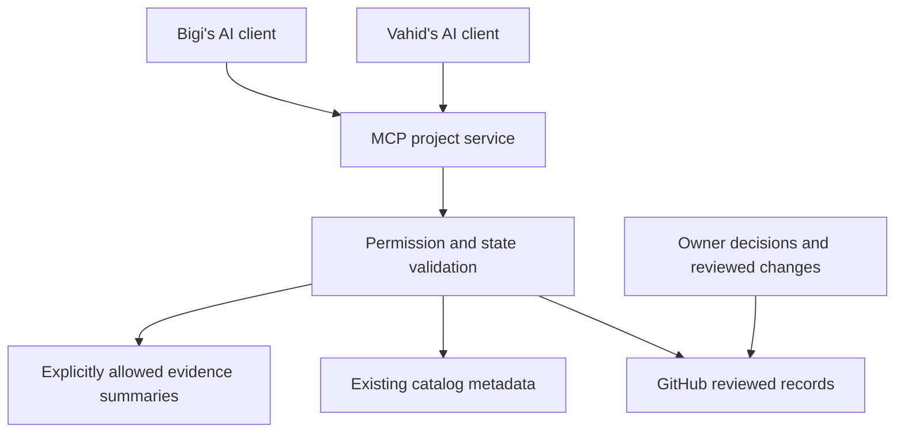

# Mynyra / py-mynyra — Canonical Project Specification

**Version:** 1.1 
**Prepared:** 2026-09-11 UTC 
**Revised:** 2026-09-11 UTC 
**Intended repository path:** `docs/PROJECT_CANONICAL.md` 
**Repository:** [wadewolfie999/py-mynyra](https://github.com/wadewolfie999/py-mynyra) 
**Document role:** consolidated project definition, business goals, management requirements and MCP implementation specification. 
**Publication/adoption status:** owner approved the recommendation to adopt this operating specification with the four review corrections, stating “recommendation is approved. proceed”. Those corrections are incorporated in version 1.1. Repository adoption on `main` remains pending; no merge is claimed. 
**Implementation status:** management and MCP requirements below specify the target behavior; they do not claim a server, integration or automation is running.

**Contents:** [Project definition](#1-project-definition) · [Business goals](#2-business-goals-and-evidence-of-success) · [Project management](#3-project-management-operating-model) · [MCP implementation](#4-project-management-implementation-through-mcp) · [Delivery and acceptance](#5-implementation-work-packages-and-acceptance).

## 0. Authority, scope and reading order

The [existing canonical problem specification](03-Mynyra_Real_Problem_Specification_CANONICAL.md) remains the authority for the economic objective. It explicitly names Vahid as owner. This document makes that objective operational without replacing the original specification or rewriting historical experiments. Version 1.1 is the designated operating specification following owner approval. `PY_MYNYRA_PROJECT_BASELINE.md` is superseded as an operating proposal and retained only as supporting history. The original canonical economic specification remains authoritative.

Read this document for the governing definition and operating design. Read the relevant campaign's protocol, registry and decision freeze for its actual scope, evidence and permission boundaries. Read README as navigation, not as an independent approval record.

Terms used throughout:

| Term | Meaning |
| --- | --- |
| Established | Supported by the canonical problem statement, inspected repository records, or explicitly identified owner/user instructions. |
| Specified | Required behavior of the management/MCP design being documented; not a claim of implementation or deployment approval. |
| Unresolved | A fact, threshold, assignment or technical dependency not yet established. It must not be silently filled in. |
| Reported evidence | A result recorded by an earlier operation. Reading the report does not independently reproduce that result. |

Current explicit authorization governs actions. A document, task status, merged PR, available tool, or successful command cannot enlarge that authorization. Changes to an experiment's scientific contract require a new registered experiment where existing rules require one; changes to this management document cannot retroactively change a campaign result.

## 1. Project definition

### 1.1 Purpose

Mynyra is the bounded endeavor to identify and establish a survivable path from the verified current financial, technical and operational state to the first financially self-sustaining state. That state requires repeatable, actually realizable trading cash flow that materially finances continued operation and reduces dependence on external capital.

`py-mynyra` is the Python implementation and research workstream serving this objective. Its code, data preparation, simulations, integrations and operating procedures are means whose value must be demonstrated against the economic objective.

The development trajectory and economic trajectory are separate. Finishing a trading bot does not establish income. A research rejection can remove uncertainty without producing income. A successful connection establishes access, not a profitable strategy.

### 1.2 Problem being addressed

The project must find useful, authorized next actions under scarce time and capital. It must also preserve the results of those actions so that people and AI sessions can continue from a reliable shared state.

Repeated coordination friction is a reported operational concern. Inspection found stale entry summaries and documented artifact-identity repairs. It has not established that missing infrastructure is the dominant cause of delay, or that an MCP server will produce net savings.

### 1.3 Scope

In scope when covered by an applicable work-package authorization:

- comparing feasible economic routes and identifying the cheapest decision-relevant uncertainty to resolve;
- strategy hypothesis research, data assessment, fixed experiment design and bounded execution;
- appropriate independent validation, operational proof and recovery;
- narrowly justified Python development, documentation and reusable evidence handling;
- coordination between Vahid, Bigi and AI sessions through GitHub records and an explicitly scoped MCP interface;
- separately authorized steps toward account feasibility, execution, cash receipt and repeatability.

Potential routes may include manual procedures, technical probes, existing tools and automation. Inclusion in this scope is not permission to execute a route.

### 1.4 Non-objectives

Finishing all software features, maximizing automation, implementing nine administrative phases, building a general agent platform, adopting a particular database, or generalizing Mynyra into another product are not independent success criteria. Neither a forced strategy winner nor another research campaign is required after a negative result.

### 1.5 Completion, pause and termination

The overarching endeavor is successful only when the owner accepts evidence against the economic completion criteria in Section 2. A completed work package is a narrower milestone.

A work package may close with advance, reject, inconclusive, invalid-evidence, deferred or abandoned disposition. Preserve its evidence and reasons. Reconsider or stop a route when its assumptions become invalid, the authorized budget is exhausted, a STOP condition applies, or another admissible action offers better decision value. Continuing profitable operation after establishment is an operating responsibility, not an indefinitely unfinished development project.

### 1.6 Current reference baseline

Repository `main` was checked at `fd016456205e3ef35c9b7ec487fad51362c516e4`, merged on 2026-09-11 at 07:34:04 UTC. This is an observation, not a promise that the branch will remain unchanged.

- The [four-work-package research sequence](RESEARCH_EXPANSION_SEQUENCE.md) records Step 4 closeout.
- The [Step 4 report](PRAXIS_STEP4.md) records 1,344 completed exploratory cases for ten additional candidates, unchanged SMA and no-trade. The original five and ten additional candidates are 15 unique strategies across the two campaigns.
- The [Step 4 freeze](PRAXIS_STEP4_FREEZE.md) records no advancement; all ten additional candidates failed economic gates.
- The [protocol](PRAXIS_STEP4_PROTOCOL.md) prohibited advancement and evaluation regardless of the screen outcome because suitable independent data was unavailable. Economic rejection is a separate result.
- January-March is already observed/exploratory. April and its original May tail remain sealed. There is no automatically authorized fifth step.
- Replay, accounting and recovery successes are reported in the records. This document does not claim independent verification of private artifacts or access to the receiving operator's machine.

The starting market is **XAUUSD/M1**; replacing the instrument or timeframe requires comparative evidence and the applicable owner decision. cTrader integration remains **demo-only and view-only**. No order-placement path is implemented or authorized. Live endpoints, broader token scope, and demo/live orders require explicit authorization and the missing risk/recovery contracts. These boundaries are recorded in [AGENTS.md](../AGENTS.md).

The campaign freeze owns that campaign decision. This baseline paragraph must never override a later properly authorized decision or imply that a new campaign has begun.

## 2. Business goals and evidence of success

### 2.1 Primary goal

Reach the first state in which repeatable cash actually received from trading materially finances operation, reduces dependence on external financing, and leaves enough recoverable resources to survive the ordinary failures defined by the owner.

Optimize elapsed time and scarce capital consumed together, subject to evidence quality, authority, survivable failure, operational safety and recoverability. Urgency must neither weaken necessary evidence nor justify indefinite infrastructure work.

### 2.2 Goal register

| ID | Goal | Evidence or measure | Present status |
| --- | --- | --- | --- |
| BG-01 | Establish repeatable usable cash flow. | Reconciled receipts, attributable costs, obligations, operating coverage and remaining reserves across an agreed observation period. | Not established by the inspected strategy records. Numeric acceptance values remain unresolved. |
| BG-02 | Select worthwhile next work with limited time and capital. | Each material work package identifies its decision, alternatives, expected information, effort/spend boundary, stopping rule and failure residue. Compare actual use against its allowance. | Governing action test exists; no complete current time/capital budget is established here. |
| BG-03 | Preserve survivability and recoverability. | Explicit exposure limits, recoverable evidence, applicable recovery proof and named responsibility. | Local recovery evidence is reported; personal financial limits and an end-to-end operating recovery envelope are not fully established. |
| BG-04 | Accumulate reusable research knowledge. | Fixed identities, complete candidate dispositions, limitations, evidence references and reusable assets carried into the next authorized decision. | Step 4 closeout exists; independent evaluation remains unavailable under that campaign's contract. |
| BG-05 | Reduce avoidable coordination work. | Measured active context-recovery time, clarification requests, stale/conflicting answers and repair effort, compared across suitably comparable handoffs. | Documentation gaps observed. Operator baseline and savings unmeasured. |

BG-04 and BG-05 are enabling goals. Improving them does not itself establish BG-01.

### 2.3 Accounting and completion rules

Keep gross P&L, modeled net P&L, realized account profit, withdrawable profit, cash received and net usable assets separate. Report the period, currency, fees, losses, transfers and obligations relevant to each claim. Do not count financing inflows as trading income or confuse a virtual account reset with a payout.

Before declaring financial self-sustainability, the owner must set and accept:

| Required parameter | Current treatment |
| --- | --- |
| Minimum net cash-received target and measurement period | Unresolved; the historical $300/week waypoint is not an adopted completion threshold. |
| Required operating-cost coverage and permitted external-financing dependence | Unresolved. |
| Repeatability duration and qualifying observations | Unresolved; one receipt is insufficient. |
| Minimum reserve and ordinary failures it must withstand | Unresolved. |
| Maximum personal loss, additional debt, spend, attempts and STOP conditions | Must be explicit before consequential exposure; virtual $3,000 balance is not a personal budget. |
| Eligible account/operator, current rules and practical cash-receipt route | Must be verified for a selected economic route before relying on it. |

Keep sensitive financial values in authorized private records. Public GitHub records may reference their status, owner and verification date without disclosing values. Missing financial thresholds do not block ordinary authorized read-only analysis; they block claims or actions that depend on them.

### 2.4 Test for every material action

Record: the economic movement it may enable; the important uncertainty it removes; irreversible time/capital/access loss; the state remaining after failure; and the applicable authorization. Compare a materially cheaper alternative when it could answer the same decision. Do not turn this into a separate approval ceremony for each routine action already within approved scope.

## 3. Project management operating model

### 3.1 Roles and authority

| Role | Responsibility | Limit |
| --- | --- | --- |
| Vahid/Wade — project owner | Owns the economic direction and final material scope, exposure and advancement decisions under the established project instructions. | Must bind decisions to their actual scope and evidence; ownership is not evidence that a decision has already been made. |
| Bigi — receiving research operator | Research preparation, review, evidence organization, proposed changes and handoff. PR #12 explicitly identifies the research handoff. | Receiving work does not transfer final approval or create permission for a new campaign, spending, broker operations or strategy promotion. |
| Assigned work-package executor | Performs the authorized work, preserves attempts, reports results and limitations. May be a person assisted by AI. | Does not accept its own output as a material owner decision. |
| Assigned reviewer | Checks evidence, contract compliance and claimed scope. | Replay or a second AI opinion is not independent market evidence. |
| MCP/service maintainer | Owns integration operation, access configuration, failure handling and recovery. | Assignment unresolved; do not silently assign Bigi or Vahid an ongoing service obligation. |

The original canonical specification names Vahid as owner. The finer Bigi/Wade authority boundaries above consolidate the supplied operating context and the [PR #12 handoff comment](https://github.com/wadewolfie999/py-mynyra/pull/12#issuecomment-5630860041); they are not inferred from GitHub permission levels. Record an explicit durable authorization reference for each future material action.

### 3.2 Lifecycle used now

Use four recurring phases for bounded work. Their size depends on the decision; they need not become four separate documents or meetings.

| Phase | Required output and exit |
| --- | --- |
| 1. Define the next decision | Current state, useful question, economic/information rationale, responsible person, limits and permission. Exit: a worthwhile bounded work package or a documented decision not to proceed. |
| 2. Prepare and establish readiness | Reused assets, required inputs, method/protocol, evidence claim, failure checks and acceptance criteria. Exit: prerequisites and scope adequate for that claim, or an explicit blocker. |
| 3. Execute and verify | Identified attempts, retained outputs, applicable verification and limitations. Exit: complete reviewable evidence or a preserved failure/incomplete state. |
| 4. Decide, close and hand off | Disposition, reasoning, evidence references, remaining restrictions, next decision owner and permitted action. Exit: usable closeout, including negative and inconclusive outcomes. |

Monitoring of scope, time, spend, evidence and blockers continues across all four phases. Closeout is required for each campaign, not postponed to final system delivery. A large phase becomes a subproject only if separate scope, ownership, allowance or acceptance makes the work easier to manage.

Independent validation, operational validation, bounded economic attempts, cash realization and sustained operation are conditional future transitions. They retain their own evidence and authority requirements; this document does not activate them. The earlier nine-phase proposal is a reference decomposition, not nine mandatory active stages.

### 3.3 Minimum work-package and handoff contract

Use one record per material work package, with links instead of duplicated reports:

| Field group | Required content and reason |
| --- | --- |
| Identity and purpose | Stable work-package ID, campaign/experiment ID when applicable, question, intended output and parent business goal. Prevents mixing campaigns and activities. |
| Scope and resources | Included/excluded work, dependencies, allowed inputs, resource/time/spend limits, stop/revisit conditions and authority reference. Prevents uncontrolled expansion. |
| Ownership | Executor, reviewer where required, next decision owner, permitted updater. Separates preparation from approval. |
| Execution and evidence | Attempt IDs, code/config/input versions, output references, validity and verification scope. Distinguishes complete, failed and invalid attempts. |
| Decision | Outcome, reason, evidence references, actor and time; prior decision superseded if any. Preserves why the present state applies. |
| Handoff | Current restrictions/blockers, next authorized action or explicit absence, trigger for reconsideration, source revision and last verification time. Prevents context reconstruction and stale permission. |

Use existing identifiers and fields when they already satisfy the contract. An unknown field must be explicit with an owner for resolving it; do not add mandatory detail unrelated to the work package's risks or decision.

### 3.4 Separate state dimensions

Do not encode everything as a single green/red status:

- **Execution:** planned, running, interrupted, failed, complete.
- **Evidence validity:** unchecked, valid-for-stated-scope, incomplete, invalidated.
- **Evidence access:** available, not_available, not_permitted, not_checked, relative to the requesting actor and inspection environment.
- **Verification scope:** report-read, metadata-checked, digest-verified, or numerically-reproduced, with the verifier and relevant source/version identified. These describe distinct checks, not interchangeable claims.
- **Decision:** pending, reject, inconclusive, advance, defer, abandon.
- **Authorization:** permitted-within-scope, not-authorized, expired/revoked, unresolved.

Evidence can be valid for its stated scope while unavailable to the present reader. Conversely, accessible bytes need not be valid evidence. Access does not change validity, and a recorded prior verification must remain distinct from checks performed by the service. Section 4.4 carries these as separate response fields.

Step 4 illustrates the distinction: completion and verification are reported, strategies are rejected for advancement, independent evaluation is unavailable, and no next campaign is authorized. A tool's successful return cannot change these other dimensions.

### 3.5 GitHub implementation and update rules

GitHub holds the shared versioned documents, code, protocols and public decision records. Use one issue or existing task record for an active work package when useful; use a focused branch/PR for versioned changes. Do not create duplicate task surfaces. Repository writes remain subject to the operator's actual authorization.

The responsible updater maintains the work-package record after a material scope/input change, attempt completion/failure, evidence invalidation, owner decision, or permission change. A completion update includes closeout links. The reviewer checks the claims; the owner supplies any material approval. A source change invalidates affected derived summaries until regenerated and checked.

Resolve conflicts by fact ownership: campaign freeze for campaign decision, registry for numerical settings, GitHub metadata for merge state, explicit owner instruction for authorization. Do not use newest timestamp alone. A conflict in equally applicable authority stays unresolved and goes to the decision owner. Historical records remain historical; never rewrite a result to fit a later plan.

### 3.6 Management measurements

Measure coordination (finding state, clarifying ownership, preparing handoff), project execution (research, implementation, scientific review), integration build/maintenance, and waiting/machine runtime separately. Classify rework by its cause. Review at work-package boundaries and material events; do not impose an unproven daily ceremony.

Compare saved handling effort against build, review, maintenance, failure-recovery time and cash cost over the same realistic horizon. The operator handoff test has been prepared but not conducted. No baseline, target percentage, saved hours or MCP payback is established. Familiarity can make a second reading faster even without a better system.

## 4. Project management implementation through MCP

### 4.1 Purpose and architecture decision

**Specified design:** provide a small project-state service that lets authorized AI clients read the same current decisions, evidence references, restrictions and next-action boundaries, then add narrowly scoped record-maintenance operations only when authorized and justified.

MCP supplies the interface through which AI applications access resources and tools. The project defines the data semantics, permissions, updates and decision rules. MCP alone does not provide shared memory, establish authoritative facts or decide when a strategy may advance. [MCP architecture](https://modelcontextprotocol.io/docs/2026-07-28/learn/architecture).

GitHub hosts the project repository and reviewed definitions. An MCP server is a separate running process on an approved operator machine or service. Repository hosting is not server deployment. A working local process is not proof of cross-machine integration.

The diagram describes the target architecture, not installed services. The service has no broker, trading or sealed-data connection.

### 4.2 Sources of truth

| Information | Canonical source | Service behavior |
| --- | --- | --- |
| Project definition and goals | Original problem specification and this adopted document | Return versioned text; expose adoption state. |
| Work-package status and assignments | Designated GitHub work-package record | Read exactly the referenced record and revision. |
| Campaign decisions and constraints | Existing campaign freeze and owner authorization records | Resolve authority explicitly; never replace with an AI-generated conclusion. |
| Numerical protocol and identity | Existing registry, frozen source and manifests | Preserve identities and exact references. |
| Dataset/run/artifact relationships | Existing SQLite catalog where accessible and permitted | Allowlisted metadata queries only; no new database required for the initial service. |
| Private numerical evidence | Existing authorized private files | Return permitted aggregate content or an access limitation. Never imply GitHub contains ignored artifacts. |
| Combined current view | Derived response/cache | Regenerable; includes source revisions, conflicts and freshness. Not another approval source. |

Start with GitHub records and explicit document mappings. Catalog access is optional for a basic documentary view and mandatory only for a claim requiring catalog verification. Keep unavailable evidence visible. Do not copy a live database between machines as a synchronization mechanism.

### 4.3 Minimum interfaces

These are proposed application-level names, not standard MCP methods. Implement with the official Python MCP SDK and validated input/output schemas. Expose equivalent read operations as resources where the selected clients support them. MCP defines resources for readable context and tools for callable operations. [Resources](https://modelcontextprotocol.io/specification/2026-07-28/server/resources), [tools](https://modelcontextprotocol.io/specification/2026-07-28/server/tools).

| Interface | Input | Required output | First implementation |
| --- | --- | --- | --- |
| `get_project_state` | `project_id`, optional requested revision | Current work package, evidence/decision/authorization dimensions, owners, blockers, permitted next action, source versions and freshness | Read-only. |
| `get_campaign_handoff` | `campaign_id`, optional requested revision | Closeout, rationale, exact protocol/freeze/report references, attempt lineage, restrictions and unresolved items | Read-only. |
| `get_evidence_reference` | Allowlisted `evidence_id` | Permitted locator, expected digest, evidence scope, access/verification status and last verified time | Metadata only by default; never arbitrary file reads. |
| `check_next_action` | Known `action_id`, work-package ID, expected state revision | `permitted`, `not_authorized` or `unresolved`, with exact authority source, limits and unmet conditions | Read-only check; does not grant permission or execute the action. |
| `propose_state_update` | Work-package ID, base revision, proposed fields, rationale and evidence references | Reviewable draft change and validation findings | Later bounded write capability; absent from the initial read-only server. |

`check_next_action` evaluates known action definitions against explicit authorization records. Its minimum inputs are:

| Record field | Required meaning |
| --- | --- |
| `authorization_id`, `authority_source`, `authorized_by` | Stable record identity, exact owner instruction or authorized decision reference, and who issued it. |
| `authorized_actor`, `action_id` | Who may act and which allowlisted action is covered. Each action definition states its operation, inputs, side effects and required conditions. |
| `work_package_id`, `scope` | Included resources, permitted inputs, limits and exclusions; no permission is inferred for adjacent tasks. |
| `bound_versions` | Applicable state, protocol, code/configuration and data versions; mark irrelevant bindings explicitly rather than inventing them. |
| `conditions`, `valid_from`, `expires_at` | Preconditions, resource/STOP limits and any actual validity window. Expiry may be absent if none was specified. |
| `status`, `supersedes`, `revocation_reference` | Whether the grant is active or revoked, its relation to earlier grants and evidence for any revocation. |

Return `permitted` only when the relevant grant covers the actor/action/scope, its conditions hold and no applicable prohibition or unresolved authority conflict remains. An established prohibition or known out-of-scope request returns `not_authorized`; missing, inaccessible or ambiguous authority/condition evidence returns `unresolved` with the reason. Do not treat an unreviewed proposed mapping as an authorization record.

An explicit owner instruction can carry authority even when it has not been encoded in this schema. The service must report its inability to machine-check that instruction rather than revoke it or require the owner to approve it again. The implementing operator may faithfully record already-granted scope with its source; neither the service nor an AI may enlarge it. Ordinary actions already authorized within a work package do not need separate per-command approval. Role names, credentials, successful runs and descriptive project prose alone are not grants.

### 4.4 Response contract

Each combined response includes:

- `schema_version`, `project_id`, `work_package_id` and applicable campaign/attempt IDs;
- `source_revision` and per-source versions, including Git commit or mutable record identity/update time;
- `observed_at`, `source_verified_at`, `generated_at` and `freshness` separately;
- execution, `evidence_validity`, decision and authorization status as distinct fields;
- evidence references with separate `evidence_access`, `verification_scope`, verifier and verification-source fields, using the distinctions in Section 3.4;
- next executor, decision owner and their assignment references;
- restrictions, blockers, next action and its authorization reference, or explicit absence;
- unresolved conflicts, missing inputs and any decision superseded.

Use UTC timestamps. A newly generated response is not newly verified evidence. Treat a hash copied from a report as an expected identifier; use `digest_verified` only after an authorized comparison with actual bytes. Represent `not_available`, `not_permitted` and `not_checked` separately.

Fetch one coherent repository revision per response. Record mutable issue/PR versions separately; detect changes during assembly and retry within a bounded limit or report an inconsistent snapshot. Distinguish `current_at_revision` from a claim that the remote branch was just checked. If refresh fails, return the last verified revision with an explicit stale/unavailable indicator.

### 4.5 Permission enforcement

Enforce access in server code and the underlying credentials, not solely in an AI prompt. The initial tool allowlist contains reads and non-mutating checks only. Reject arbitrary filesystem paths, SQL, shell commands, URLs and unrecognized action IDs. Restrict evidence access to explicit IDs and permitted metadata. Do not traverse sealed datasets to check their availability.

For shared HTTP operation, use authenticated identities and a read-only scope; protect credentials and logs from disclosure. Follow the applicable MCP HTTP authorization specification and verify its behavior in the actual clients. Transport authentication identifies a caller; it does not prove a material project action is approved. [MCP authorization](https://modelcontextprotocol.io/specification/2026-07-28/basic/authorization).

Later writes require the authenticated actor, exact allowed field/action scope, expected current revision, evidence references and a retry/idempotency key. Reject conflicting versions; preserve earlier records. The service may propose a change but cannot impersonate the owner, approve advancement, merge its own proposal, or convert an expired/revoked approval into current permission.

### 4.6 Update and automation sequence

For the first implementation, refresh on an explicit read and verify source revisions. A local CLI must use the same state resolver so the workflow remains usable without an AI client.

The later automation target is: an existing authorized runner finishes or fails; a validator checks the appropriate output contract; a sanitized closeout proposal is assembled; required review and owner decisions are recorded; the derived current view refreshes from those records. Completion notifications are inputs, never approvals.

Retries preserve attempt IDs and do not duplicate write effects. An incomplete run cannot appear completed because a subprocess exited successfully. Notifications or webhooks may reduce repeated manual refresh only after the manual path is correct. Reconnects must recheck sources; notifications alone do not guarantee delivery. Do not schedule new strategy campaigns as a side effect of closing an old one.

### 4.7 Runtime, hosting and dependencies

| Component | Specified choice | Completion condition / unresolved dependency |
| --- | --- | --- |
| Language | Python, using an official MCP SDK, isolated from the frozen simulator environment | Pin a compatible SDK/runtime set and test it. Do not upgrade historical experiment dependencies to satisfy the service. |
| Initial transport | Local stdio proof using public/synthetic records | Demonstrates contract behavior in one compatible client; does not establish shared access. |
| Shared transport | Authenticated Streamable HTTP to one approved service instance | Name actual client applications/versions, host, reachability, identity setup and maintainer; test both operators' clients. |
| Storage | Existing GitHub records and existing catalog; rebuildable derived cache | No new PostgreSQL, task database or raw-data mirror in the minimum design. |
| Process supervision | Required for the selected shared host | Document startup, health, logs, restart and rollback; choose the concrete mechanism with the host. |
| Logging | Structured request/result metadata, caller identity, source revision and bounded error detail | No secrets, raw market data or private financial values in logs. |
| Recovery | Git version history plus documented backups of irreplaceable private state | Rebuild the service/cache and verify references; a catalog restore alone is not a complete workstation restore. |
| Docker | Not required by this specification | Adopt only if a reproducibility/deployment problem justifies it; document its actual benefit. |
| n8n, Langflow, MLflow, queues | No initial dependency | Add only against a measured recurring workflow need that existing scripts cannot satisfy economically. |

The official transport specification defines stdio and Streamable HTTP. Check negotiated protocol and SDK/client compatibility rather than assuming all clients support the newest revision. The documentation reviewed for this design includes protocol revision `2026-07-28`; the chosen implementation version must be recorded when tested. [Transports](https://modelcontextprotocol.io/specification/2026-07-28/basic/transports), [official SDKs](https://modelcontextprotocol.io/docs/2026-07-28/sdk).

Hosting and client access are concrete dependencies for shared deployment, not explanations for historical research friction. They do not block writing or testing the local state contract.

## 5. Implementation work packages and acceptance

The following lists the available implementation packages for the specified management/MCP capability. Listing them does not start the packages or authorize deployment, spending, repository publication or new research.

**After PM-02, select and record the smallest justified implementation scope.** This is a closeout decision, not another mandatory meeting or document. Use the observed gap and expected total effort to choose:

| Finding | Selected scope and required benefit |
| --- | --- |
| Clearer GitHub records satisfy the handoff | Apply the bounded record/navigation correction and stop infrastructure work. No custom context reader or MCP service is required. |
| Repeated reconstruction benefits from a deterministic context reader | Select MCP-01. Add MCP-02 only if an actual AI-client access need justifies the adapter. Demonstrate correct, traceable context and reduced handling. |
| The actual clients require common remote access that the simpler path cannot provide | Select MCP-03 after its technical prerequisites. Demonstrate the specific shared-access benefit and account for hosting, identity, maintenance and recovery effort. |
| Routine updates remain a measured source of avoidable work | Consider MCP-04 for one identified operation. Its incremental benefit must exceed build, review, maintenance and recovery cost. |

Record the chosen scope, expected benefit, resource bound and stop/review condition in the existing work-package record. An unselected package remains deferred. Reconsider only when new evidence or requirements justify it. Research allocation is a separate decision and need not wait for a custom MCP service.

| Package | Deliverable | Acceptance evidence |
| --- | --- | --- |
| PM-01: Establish the canonical records | Adopt the definition/goals/management specification through the existing review process; add README navigation; identify the source of each current-state fact and next-decision assignment | Links resolve; authority and unknowns are explicit; historical freeze and numerical rules remain intact. |
| PM-02: Prove the handoff | Conduct the prepared operator test from PR #12 before an improved briefing; preserve answers, source path, access gaps, familiarity and measured effort | Correct state and boundaries recovered, or a precise missing-information result. No invented independent-test or savings claim. |
| MCP-01: Build the state resolver | Deterministic Python resolver and CLI over allowlisted versioned records; synthetic fixtures for conflicts, stale sources and absent authority | Same source revision gives the same substantive state; missing/conflicting inputs are explicit; no raw/sealed-data access. |
| MCP-02: Expose read-only tools | Implement the four read/check interfaces and resource mappings as supported | Actual client integration passes discovery, schemas, source traceability and negative permission tests. |
| MCP-03: Prove shared operation | Run the selected authenticated service and connect both actual operator clients | Both recover the same decision at the same revision; revoked access fails; restart preserves correctness; limitations and logs are safe. |
| MCP-04: Add one justified update automation | Automate one measured recurring closeout/status operation with bounded proposal writes | Reviewable output, no approval bypass, safe retries/conflicts, and recorded net effort including maintenance. |

When selected, MCP-01/02 provide a technical read-only prototype. MCP-03 is needed before claiming that both operators have a working shared MCP interface; it is not a mandatory destination for every handoff improvement. MCP-04 addresses recurring manual update work; a read-only interface alone does not automate that work. Proceeding between packages requires satisfaction of their actual dependencies and applicable authority, not ceremonial approval of every routine subtask.

Preserve PM-02's baseline before showing the participant improved records. If PM-01 has already been published, run the baseline against the preserved original revision and PR text, excluding these additions, and record that it is a historical baseline rather than a test of current `main`. Do not attribute familiarity with this specification to the quality of the old handoff.

### 5.1 Minimum acceptance cases

1. **Step 4 baseline:** return completed exploratory work, economic rejection, unconditional evaluation restriction, sealed April, evidence references and no authorized new campaign.
2. **Stale summary:** a README still describing the first five candidates cannot override the later Step 4 freeze. A merged PR cannot be returned as open solely because its body says so.
3. **Unavailable private evidence:** identify the reference without claiming that bytes or hashes were verified. Reading state succeeds with a stated limitation where possible.
4. **Attempt lineage:** distinguish the retained incomplete first attempt from the completed corrected batch; do not treat their counts as conflicting complete results.
5. **Authority gap:** missing or ambiguous authorization evidence yields `unresolved`; an established prohibition, revocation, expiry without a replacement grant, or known out-of-scope request yields `not_authorized`. Never grant permission by default or require renewed owner approval solely because an existing instruction is not machine-encoded.
6. **Unsafe request:** arbitrary path/SQL/command, sealed-data request, broker operation and owner-approval impersonation are rejected without side effects.
7. **Revision change:** an old cached result identifies its revision; a conflicting update cannot overwrite a newer decision.
8. **Shared-client and recovery proof:** both clients receive consistent source-bound state; service interruption or loss of cache cannot fabricate fresh data or new authority.

Passing these tests proves the stated capability. It does not prove live profitability, cash realization, general handoff reliability or economic payback.

## 6. Document maintenance and repository adoption

Place this file at `docs/PROJECT_CANONICAL.md` and link it from README as **Project definition, business goals and management/MCP specification**. Keep the original canonical problem specification linked as the economic authority. This file is the single designated operating specification; `PY_MYNYRA_PROJECT_BASELINE.md` remains superseded supporting history. Campaign protocols and freezes remain the authorities for their own facts. Owner approval in this review establishes the designation; repository publication must be recorded separately when it occurs.

The initial adoption change should be limited to this document and navigation references. Do not rewrite frozen evidence, introduce executable server code, alter scientific gates or silently mark implementation work complete as part of publication.

The document custodian must be named in the adoption record. Update this specification when its objective interpretation, governance, interface contract or implementation decisions change. Keep volatile run status in the relevant work-package/campaign records; the baseline in Section 1.6 is explicitly dated. Increment the version for material changes, record the reason and approval reference, and preserve prior versions in Git.

Rollback of a documentation or service change restores the prior version and its references; it does not erase evidence, reverse real-world actions or revive superseded permissions. A new decision must explicitly identify which prior decision it supersedes.

### Source and provenance register

| Source | What it establishes |
| --- | --- |
| [Canonical problem specification](03-Mynyra_Real_Problem_Specification_CANONICAL.md) | Economic objective, owner, constraints, decision test and non-objectives. |
| [AGENTS](../AGENTS.md), [Praxis](PRAXIS.md), [research sequence](RESEARCH_EXPANSION_SEQUENCE.md) | Existing operating discipline, restrictions and work-package closeout. |
| [Step 4 report](PRAXIS_STEP4.md), [protocol](PRAXIS_STEP4_PROTOCOL.md), [registry](../experiments/praxis_step4_v1.toml), [freeze](PRAXIS_STEP4_FREEZE.md) | Reported campaign result, exact scientific scope and no-advancement/no-evaluation decision. |
| [Corrections](PRAXIS_STEP4_CORRECTIONS.md), [recovery](PRAXIS_STEP4_RECOVERY.md) | Documented attempt lineage and artifact-recovery scope. |
| [PR #12](https://github.com/wadewolfie999/py-mynyra/pull/12) and handoff comment | Existing executive handoff and Bigi's receiving role; PR descriptions remain mutable. |
| User instructions consolidated on 2026-09-11 | Requested canonical GitHub definition/goals/management/MCP deliverable and finer operating-role context. |
| Official MCP references in Section 4 | Protocol capabilities and implementation guidance; the project-specific architecture and interfaces are this document's design. |

Repository observations are anchored to [the inspected commit](https://github.com/wadewolfie999/py-mynyra/tree/fd016456205e3ef35c9b7ec487fad51362c516e4). The investigation PDF is background analysis, not authority for project facts, approval or implementation status. No private campaign was replayed in preparing this document.

### Revision history

| Version | Date | Change | Adoption reference |
| --- | --- | --- | --- |
| 1.0 | 2026-09-11 | Consolidated project definition, business goals, proportional management cycle and concrete MCP implementation contract; preserved existing Step 4 restrictions. | Original proposal; superseded by version 1.1. |
| 1.1 | 2026-09-11 | Applied the four approved review corrections: operating boundaries, separate evidence dimensions, an explicit authorization-check contract, and conditional implementation scope. Designated this file as the operating specification and retained the earlier baseline as history. | Owner approval in this review: “recommendation is approved. proceed”. GitHub publication pending. |
