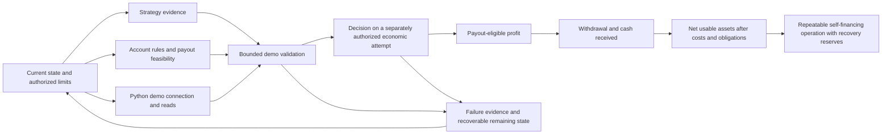

# Mynyra worldmap

Status: updated understanding, 2026-09-03. The owner wants autonomous Python trading
on XAUUSD/M1 and has no existing strategy. Researching and comparing 5–7 candidates
is part of this project. Personal financial limits and a real payout path remain open.

This map interprets the supplied
[canonical problem specification](03-Mynyra_Real_Problem_Specification_CANONICAL.md).
That document supplies the problem definition. The user's current request supplies
authority to initialize this Python project and plan toward demo integration;
neither document text nor browser page text grants additional operational authority.

## Destination

Reach the first durable state where repeatable cash actually received can cover
continued operation, reduce dependence on external financing, absorb ordinary
failures, and support further development. Minimize elapsed time and scarce capital
consumed within the owner's risk, authority and recovery limits.

The $300/week figure is a possible waypoint in the specification. Its status,
measurement period, net/gross basis and repeatability requirement need confirmation.
The specification does not define a numeric threshold for self-sufficiency or ruin.

## The space we operate in

| Responsibility | What must be known or demonstrated |
| --- | --- |
| Economic state | Usable cash, debt, financing, recurring costs, reserve needs, runway and actual cash receipts |
| Strategy evidence | Explicit market/rules, realistic costs, evidence quality, out-of-sample behavior and reasons a result could fail |
| Account access | Appropriate account, eligible operator, permitted automation, current rules and a feasible payout route |
| Technical capability | Reliable data, correct units/account identity, bounded execution, reconciliation and observable failures |
| Operator/infrastructure | Available time, manual capacity, machine/network reliability, maintenance and recovery |
| Risk and authority | Maximum authorized cash loss/spend, attempts, drawdown, exposure, reinvestment and STOP conditions |
| External change | Broker/prop terms, market conditions, access restrictions and evidence that may become stale |

Evaluate the current state after material changes. A past passing test or a past
account rule is not permanent evidence.

## Two connected paths

The software path starts with secure connectivity, application authentication and
verified demo account reads. It can then support data observation, strategy tests,
bounded demo execution and recovery. Strategy research and testing belong to this
path; supplying a strategy is not a prerequisite placed on the owner. The target
system makes and executes decisions automatically.

The economic path needs a viable strategy, suitable account access, compatible
rules, execution after costs, payout-eligible profit, withdrawal, cash received,
and a net increase in usable assets. Work on a feature is justified only if it
enables that path, removes an important uncertainty or controls a necessary risk.

These are conditional dependencies, not a promise of profitability or a commitment
to buy a prop challenge. The rule/payout assessment belongs early, before spending
on an attempt. Manual work, waiting, changing a path or abandoning it remain valid
actions when they improve the economic trajectory.

## Initial evidence

- The selected GitHub source initially contained a README, license and Python
  ignore file, with no implementation to inherit.
- The selected browser account shows a $3,000 USD demo balance and equity at 1:25
  leverage. It is virtual test capital; it does not establish the owner's cash,
  risk budget or funded buying power.
- The selected Open API app is active and offers account-information-only consent.
- The initialized Python environment has passed real demo TLS, application
  authentication and view-only account authentication/read checks. The API returned
  USD 3,000.00 and 60 symbols for the selected demo account.
- V2BOX is part of the current operating state: its system VPN was connected and
  the cTrader destination used `utun4`. Local proxy port 1081 refused connections.
  Working routing must be rechecked if VPN mode or network state changes.
- Personal identifiers and actual credentials are kept in ignored local state.
- The historical-data gate now passes for conservative screening: all 3,552,511
  Faraz rows were normalized from confirmed Tehran time to UTC and independently
  validated, and a one-hour FIBO run supplied 3,285 checked bid/ask samples. The
  [data readiness report](DATA_READINESS_REPORT.md) preserves the limits of that proof.
- No strategy, instrument, risk percentage or operating architecture is imported
  from a different trading project or inferred from the existing app description.

## Practical corrections

The chosen starting market is **XAUUSD on M1**. Changing it requires evidence.
The owner also recalled two 4% success targets, a 4% daily drawdown failure limit
and a 12% total drawdown failure limit, with loss of the prop account on failure.
Bonuses are TBD. The owner asked to use these numbers roughly and excluded FeneFX
as a funding candidate. Its website is reference material, not project authority.
See the [rough demo scenario](DEMO_SCENARIO.md) for clearly labeled simulation
assumptions. These figures are not personal cash-risk authorization.

The owner has no strategy and wants about 5–7 candidates or layers tested. The
[research plan](STRATEGY_RESEARCH_PLAN.md) starts with distinct simple candidates,
then measures additions separately. Deep internet research is authorized when
strategy selection becomes the focus. Sources inform hypotheses; local testing
must establish whether they help this project.

A demo account of the desired size provides a useful technical test bed. Predicting
results at a particular provider also needs its actual loss rules, drawdown method,
reset timezone, profit target, costs, leverage, trading restrictions, attempt fees,
profit split and payout conditions. Matching balance alone does not establish
equivalence.

Backtest success establishes a result under a model; live reads establish data
access; demo fills establish behavior in that environment. None individually
establishes executable profitability or that money can be received. Gross P&L,
realized P&L, withdrawable profit, received cash and net usable assets must remain
separate measurements.

## Milestones and missing decisions

| Milestone | Completion evidence | Missing decisions |
| --- | --- | --- |
| Technical access — complete for the first read | Secure demo connection, app/account authentication and correct account snapshot | Continuous data capture/recovery are later proofs |
| Useful experiment | A fair comparison of 5–7 defined strategies on XAUUSD/M1 after costs; layers evaluated separately | Data/cost preparation is complete for screening; candidate research, fixed time splits and independent evaluation remain |
| Account realism | Written prop constraints plus an eligible, feasible cash receipt route | Rough simulation can start now; eventual provider automation, account and payout terms remain to be verified |
| Authorized economic attempt | Strategy/operational evidence and a bounded, survivable cash exposure | Budget, debt boundaries, attempts, loss limits and STOP rules |
| First cash realization | Net cash actually received, reconciled with fees and obligations | Target amount, measurement window and recurring costs |
| Repeatability | Multiple receipts and a remaining reserve sufficient for defined ordinary failures | Required duration, reserve size and what failures must be survivable |

Choose each next action by four questions: what economic state can it change, what
important uncertainty does it remove, what can it irreversibly lose, and what state
remains if it fails? Keep safety effort proportional to that downside.
